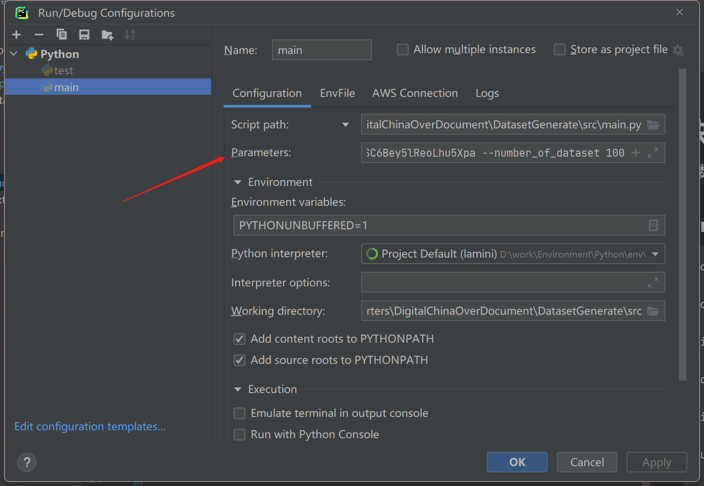

# Dataset Generation

[//]: # (![GitHub Repo stars]&#40;https://img.shields.io/github/stars/mMrBun/DatasetGenerate?style=social&#41;)

\[ English | [中文](README_zh.md) \]

- Support API retry for better reliability.
- Added progress bar for dataset generation.
- Support budget control for resource management.

Generate datasets in related domains using the OpenAI GPT3.5 API based on the provided topics.

This project was inspired by the paper of [LaMini](https://github.com/mbzuai-nlp/LaMini-LM). The original approach in the paper involved scraping entries from Wikipedia, filtering them based on certain criteria, and then using the prompts below to make inquiries to GPT3.5:

~~~ xml
<example>Try coming up with a creative way to stay motivated during a workout.</example>
<example>In your opinion, what are the qualities of an effective sports coach?</example>
<example>Return the SSN number for the person: "Yann LeCun"</example>
Generate 20 diverse examples that are similar to the provided examples with the topics "Design, bureaus, Conidae, Infantry".
You do not need to provide a response to the generated examples.
Each example must include an instruction.
Each generated instruction can be either an imperative sentence or a question.
Each example must start with the label "<example>" and end with the label "</example>".".
~~~

The obtained questions are then presented to GPT3.5 to obtain answers, which constitutes one data entry. By repeating the above steps, a general-purpose dataset can be generated.

I have made a slight modification to the approach of prompt-guided generation. Based on the provided topic, I generate relevant subtopics using the prompt below, and then construct the dataset using the aforementioned steps:

~~~ xml
Use the content within the <Topic> tags as the main topic to generate {int(generalization_index * generalization_basic)} subtopics.
Each subtopic should have a maximum of 6 words.
Wrap each subtopic with <SubTopic> at the beginning and </SubTopic> at the end.
Here are some examples:
-- <Topic>When is the Spring Festival coming?</Topic>
   <SubTopic>Year Beast</SubTopic>
   <SubTopic>Red Envelope</SubTopic>
   <SubTopic>Firecrackers</SubTopic>
   <SubTopic>Window Paper-cutting</SubTopic>
   <SubTopic>Spring Couplets</SubTopic>
-- <Topic>Leo's fortune</Topic>
   <SubTopic>Pop Culture</SubTopic>
   <SubTopic>Deep Space Objects</SubTopic>
   <SubTopic>Characteristics</SubTopic>
   <SubTopic>Capricorn</SubTopic>
<Topic>{topic_name}</Topic>
~~~

## Quick Start

For parameter details, please refer to the [WIKI](https://github.com/mMrBun/DatasetGenerate/wiki).

### Linux
~~~ sybase
conda create -n dataset_generate python=3.8

conda activate dataset_generate

git clone https://github.com/mMrBun/DatasetGenerate.git

cd DatasetGenerate

pip install -r requirements.txt 

sudo chmod +x job/simple_generate.sh

job/simple_generate.sh
~~~

### Windows
Fill in the necessary parameters in the command line

~~~ sybase
--topic "Why is it more suitable for crabs to move sideways rather than straight when they are in water?" --api_key sk-xxx --number_of_dataset 100
~~~